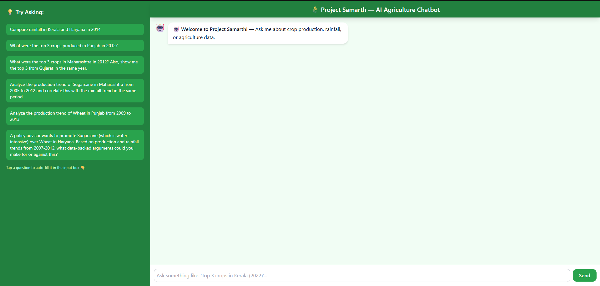
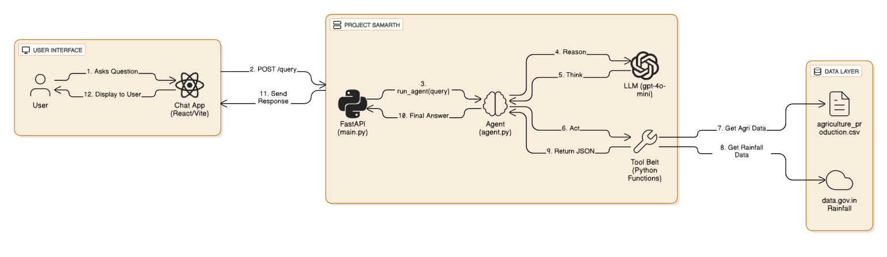

# Project Samarth: AI Q&A for Indian Government Data

An intelligent **AI Q&A system** designed to answer **complex, natural language questions** about **India's agricultural economy and climate patterns** by synthesizing data from **disconnected government sources** (both live APIs and static CSVs).

This project was built as part of the **Project Samarth Challenge**, which required building a system capable of **reasoning across multiple, inconsistent data sources** to provide **traceable, data-backed insights**.

---

## ✨ Project Showcase

Below is a sample of the agent handling complex, multi-step queries.  
It identifies the required tools, executes them in sequence, and synthesizes the final, **cited** answer.

📸 **A-1:** The agent answering a multi-step *compare* query with table output and citations.  
<!-- Replace this placeholder with your demo image -->


---

## 🏛️ System Architecture

The system follows a **clean, scalable, and decoupled architecture**.  
At its core lies a **multi-step Reasoning Engine (`agent.py`)** that interacts with a **Tool Belt** to access and process data from the backend.

📸 **A-2:** Full system architecture from UI to Data Layer.  
<!-- Replace this placeholder with your architecture diagram -->


You can also view the detailed Mermaid.js diagram in the documentation.

---

## 🎯 Core Features

✅ **Multi-Step Reasoning**  
Handles queries like *“compare X and Y”* by calling the right tools in sequence and synthesizing results.

✅ **Data-Backed Synthesis**  
Forms qualitative arguments (e.g., *“promote Crop A over Crop B”*) using production and rainfall data.

✅ **Trend Analysis**  
Generates dynamic time-series plots for production and rainfall trends over custom year ranges.

✅ **District-Level Insights**  
Identifies top or bottom-producing districts for specific crops.

✅ **Accuracy & Traceability**  
Every numeric insight includes a **citation** to its source — a key evaluation metric.

✅ **Robust Error Handling**  
Gracefully handles missing or incomplete data without breaking.

---

## 🛠️ Technology Stack

| Component | Technology | Description |
|------------|-------------|-------------|
| **Backend** | FastAPI (Python) | High-performance REST API backend |
| **Frontend** | React / Vite | Modern, fast web interface |
| **Agent Core** | LangChain + OpenAI | Uses `gpt-4o-mini` for reasoning |
| **Logic Engine** | Multi-Step ReAct Loop | Implements the "Reason-Act" paradigm |
| **Data Tools** | Pandas | Fast, in-memory CSV querying |
| **Data Tools** | Requests | Fetches live data from [data.gov.in](https://data.gov.in) |

---

## ⚙️ Setup & Installation

Follow these steps to run the project locally.

---

### 1️⃣ Backend Setup (`/backend`)

```bash
# Move into the backend directory
cd backend

# Create a Python virtual environment
# (Windows)
python -m venv mini
mini\Scripts\activate
# (Mac/Linux)
# python3 -m venv mini
# source mini/bin/activate

# Install dependencies
pip install -r requirements.txt

# Create environment variables file
# (Windows)
copy nul .env
# (Mac/Linux)
# touch .env


Now open the `.env` file and add your keys:

```bash
OPENAI_API_KEY="sk-..."
DATA_GOV_API_KEY="..."

backend
uvicorn main:app --reload

frontend

# Open a new terminal
cd frontend

# Install dependencies
npm install

# Run the development server
npm run dev


Project-Samarth/
├── backend/
│   ├── main.py
│   ├── agent.py
│   ├── tools/
│   ├── data/
│   └── requirements.txt
├── frontend/
│   ├── src/
│   ├── public/
│   ├── vite.config.js
│   └── package.json
└── README.md

```

## ❓ Sample Questions to Try

### 🔹 Level 1: Simple Lookups
- “How much Wheat was produced in Haryana in 2012?”
- “What was the total rainfall in Kerala in 2015?”

### 🔹 Level 2: Comparisons (Multi-Step)
- “Compare rainfall in Kerala and Haryana in 2014.”
- “What were the top 3 crops in Maharashtra in 2012? Also show the top 3 in Gujarat.”
- “Compare total production of Rice in Punjab and West Bengal in 2013.”

### 🔹 Level 3: District-Level Analysis
- “Find the district in Punjab with the highest Rice production in 2012 and compare it with the lowest-producing district in Haryana.”

### 🔹 Level 4: Trend Analysis & Correlation
- “Analyze the production trend of Wheat in Punjab from 2009–2013.”
- “Correlate Sugarcane production and rainfall trends in Maharashtra (2005–2012).”

### 🔹 Level 5: Policy & Synthesis
- “Write a report promoting drought-resistant crops like Maize over water-intensive Sugarcane in Maharashtra (2000–2010).”


## 🚀 Future Improvements

- 🧩 Integrate vector-based retrieval for policy documents  
- 🌦️ Expand climate data tools (temperature, drought index)  
- 📊 Add visual dashboards for production & rainfall trends  
- 🪶 Support Hindi and other regional languages  

---

## 📜 License

This project is open-source under the **MIT License**.

---

## 👨‍💻 Contributors

- **Naveen Gill** – Developer & Architect  
- Contributions welcome! Open a PR or issue on GitHub.

🔗 **GitHub Repository:** [NaveenGill124/project_samarth](https://github.com/NaveenGill124/project_samarth)


